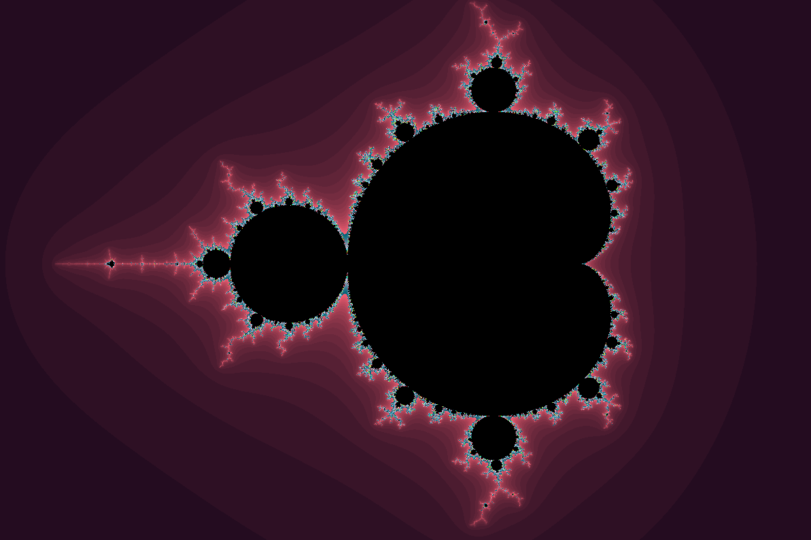

# Множество Мандельброта
Работа, созданная в качестве задачи учебного курса Дединского Ильи Рудольфовича.


## Цели
1. Познакомиться с методами оптимизации. 
2. Изучение SIMD инструкций.


## Программа
Данная программа отрисовывает множество Мандельброта (картинка ниже). Задача является хорошим примером использования SIMD инструкций.





## Управление


Стрелка Вверх  - передвигает картинку вверх     \
Стрелка Вниз   - передвигает картинку вниз      \
Стрелка Влево  - передвигает картинку влево     \
Стрелка Вправо - передвигает картинку вправо  


Клавиша A - приближение картинки                \
Клавиша S - отдаление картинки                  \
Клавиша P - отключение отрисовки картинки     


## Оптимизация


Ускорение времени работы программы удалось достичь благодаря векторным инструкциям AVX2. Рассмотрим различия между оптимизированной и наивной реализацией алгоритма вычисления. Обе программы были скомпилированы с флагом -O2.


Рассмотрим фрагменты кода:


``` C
float x2 = x * x;
float y2 = y * y;
float mul_xy = x * y;
```


``` C
__m256 x2_ = _mm256_mul_ps(x_, x_);
__m256 y2_ = _mm256_mul_ps(y_, y_);
__m256 xy_ = _mm256_mul_ps(x_, y_);
```


Сверху представлен код в наивной реализации, снизу - оптимизированной.
Оба этих блока в программе рассчитывают значение квадратов координат пикселя, а также их произведение.


Снизу представлены ассемблерный код данных фрагментов после реверстки (источник: [Godbolt](https://godbolt.org/)).

Навивная реализация:
```
vmulss  xmm3, xmm0, xmm0
vmulss  xmm1, xmm2, xmm2
vmulss  xmm0, xmm2, xmm0
```

Использованием SIMD команд:
```
vmulps  ymm13, ymm3, ymm3
vmovdqa ymm6, ymm7
vmulps  ymm2, ymm1, ymm1
vmulps  ymm3, ymm1, ymm3
```


Из этого небольшого фрагмента видно, что наивная реализация использует xmm регистры для того, чтобы рассчитать значения с плавающей точкой, в то время как AVX2 команды задействуют ymm регистры в полной мере. Именно распараллеливание вычислений восьми пикселей за раз дает прирост в скорости работы программы.


## Сравнение


Замер происходит при полной зарядке ноутбука при питании от сети.
Отрисовка картинки была отключена. Это было сделано для того, чтобы принебречь временем, затраченным на отричовку картинки.
В обоих случаях компиляция происходила с флагам -O2.


| Версия            |    FPS       |
| ----------------- | ------------ |
| Без  оптимизации  | 5.35 FPS     |
| AVX2 оптимизации  | 33.3 FPS     |


Для отображения более точного расчета времени на вычисление одного пикселя (чтобы время отрисовки было пренебрежительно) было решено запустить программу расчета 100 раз, только после чего выводилось время.


| Версия            |    FPS       |
| ----------------- | ------------ |
| Без  оптимизации  | 5.75 FPS     |
| AVX2 оптимизации  | 40.3 FPS     |


Из представленных результатов можем сделать вывод, что мы смогли достичь выигрыш 40,3 / 5.75 примерно в 7 раз.


